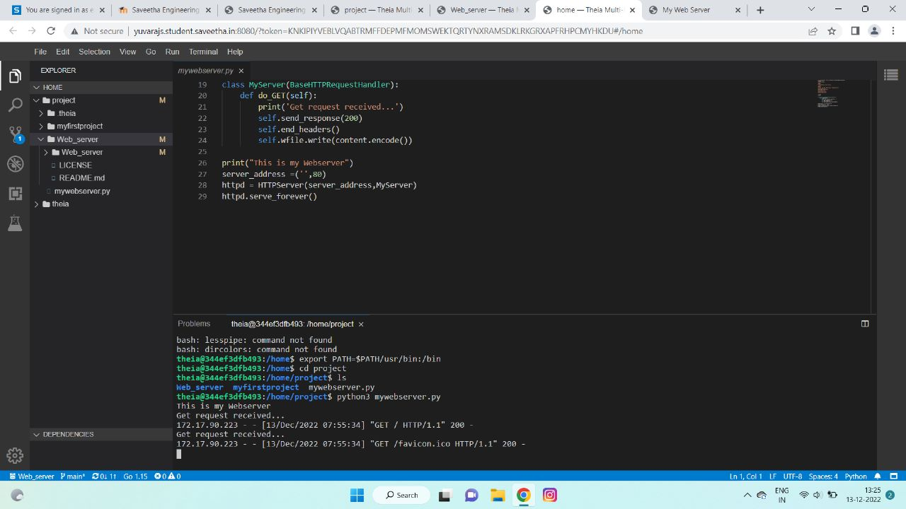
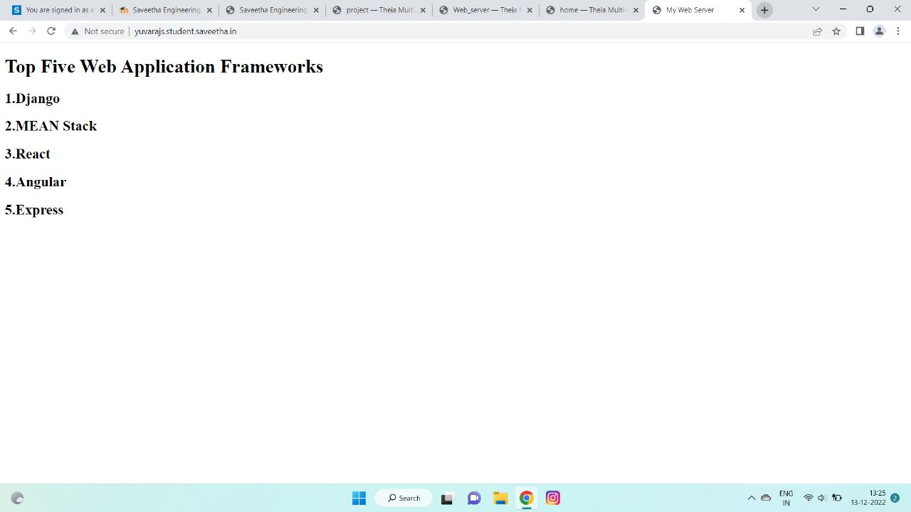

# Developing a Simple Webserver

# AIM:

Develop a webserver to display about top five web application development frameworks.

# DESIGN STEPS:

## Step 1:

HTML content creation is done

## Step 2:

Design of webserver workflow

## Step 3:

Implementation using Python code

## Step 4:

Serving the HTML pages.

## Step 5:

Testing the webserver

# PROGRAM:
```
from http.server import HTTPServer,BaseHTTPRequestHandler
content = """
<!DOCTYPE html>
<html>
<head>
<title>My Web Server</title>
</head>
<body>
<h1>Top Five Web Application Frameworks</h1>
<h2>1.Django</h2>
<h2>2.MEAN Stack</h2>
<h2>3.React</h2>
<h2>4.Angular</h2>
<h2>5.Express</h2>

</body>
</html>
"""
class MyServer(BaseHTTPRequestHandler):
    def do_GET(self):
        print('Get request received...')
        self.send_response(200)
        self.end_headers()
        self.wfile.write(content.encode())

print("This is my Webserver")
server_address =('',80)
httpd = HTTPServer(server_address,MyServer)
httpd.serve_forever()        
```

# OUTPUT:
###Server Side Output


###Client Side Output


# RESULT:

The program is executed succesfully
